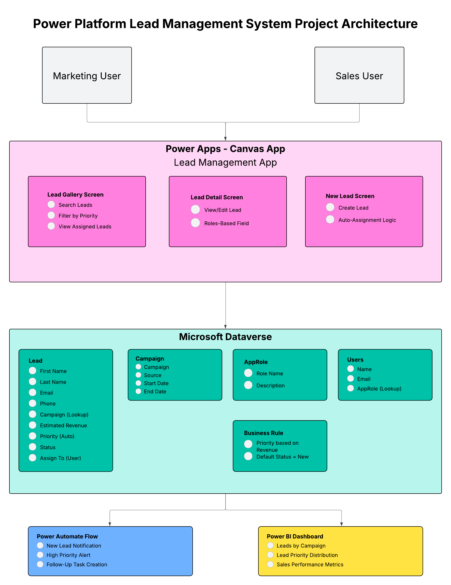

# Power Platform Lead Management System

## Overview
This project is a **Dataverse-backed Power Platform solution** that demonstrates how to capture, manage, and analyze marketing leads using **Power Apps (Canvas App)**, **Power Automate**, and **Power BI**. It mirrors real-world Dynamics 365 workflows, providing automated lead assignments, conditional business rules, role-based access, and interactive dashboards.

---

## Tech Stack
- **Power Apps (Canvas App)** – Lead capture and management interface
- **Dataverse** – Core data tables and business rules
- **Power Automate** – Automated workflows for notifications, tasks, and follow-ups
- **Power BI** – Campaign and lead analytics dashboards

---

## Architecture
[LucidCharts Diagram](https://lucid.app/lucidchart/4bbe52a3-99e2-47f7-8fba-78b5cf496d93/edit?view_items=fAVo5o-iRTTF&page=0_0&invitationId=inv_9d216f18-dc6e-44a7-885b-29a749e1fc26)
- **Dataverse Tables**
  - `Lead` – stores all leads and contact information
  - `Campaign` – lookup table for marketing campaigns
  - `AppRole` – optional table for user roles (Marketing vs Sales)
- **Business Rules**
  - Auto-set lead priority based on Estimated Revenue
- **Security Roles**
  - Marketing: Create/Edit Leads
  - Sales: Access assigned leads only
- **Canvas App Screens**
  - New Lead Form
  - Lead Gallery
  - Lead Detail / Edit Form
- **Power Automate Flows**
  - New lead notifications
  - High-priority lead alerts
  - Follow-up task creation
- **Power BI Dashboards**
  - Lead distribution by campaign, source, and priority
  - Conversion metrics and sales performance

---

## Key Features
- **Lead Capture & Management** – User-friendly Canvas App to add and edit leads
- **Business Rules / Conditional Logic** – Priority auto-assignment based on Estimated Revenue
- **Role-Based Access Control** – Marketing and Sales user roles with appropriate permissions
- **Interactive Analytics** – Power BI dashboards to visualize campaign and lead performance
- **Enterprise-Style Implementation** – Uses Dataverse tables, business rules, and security roles aligned with Dynamics 365 CE architecture

---

## Screenshots

---

## Demo Video
A short **2–3 minute demo** showcasing the app, workflows, and dashboards:  
[Demo Video Link](demo/demo-video-link.txt)

---

## How to Run / Explore
1. **Download the solution ZIP** from the `solution/` folder
2. Import it into your **Power Apps Developer Environment**
3. Review **Dataverse tables**: Lead, Campaign, AppRole
4. Explore the **Canvas App screens**
5. Test **Power Automate flows**
6. View **Power BI dashboards** via provided report file or workspace

---

## Why This Project Matters
This project demonstrates **real-world skills** for:
- Microsoft Dynamics 365 CE / Power Platform roles
- Building enterprise-ready Canvas Apps
- Implementing Dataverse business rules and security roles
- Automating business processes with Power Automate
- Visualizing data with Power BI

It’s a **full-stack Power Platform showcase** suitable for a portfolio or interview demonstration.

---

## License
This project is for **educational and portfolio purposes**.
